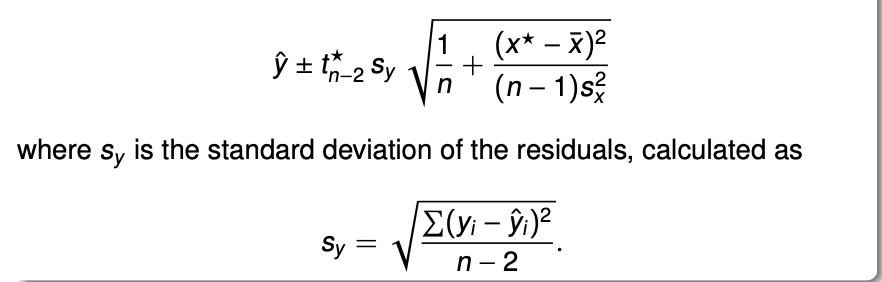
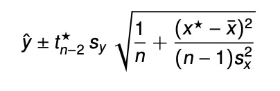

```{r setup, include=FALSE}
knitr::opts_chunk$set(echo = TRUE, warning = FALSE)
library(tidyverse)
library(ellipse)
```

## Question 1
In this problem, Let $\textbf{y}$ denote stiffness ($lb/in^2$) and $\textbf{X}$ denote the design matrix. We want to investigate the relationship between stiffness and density($lb/ft^3$). Since here we have 30 observations, and we only have one predictor and one outcome, the dimension of $\textbf{y}$ is $30\times 1$ and the dimension of $\textbf{X}$ is $30 \times 2$.
Then we have:
$${\textbf{y}}=\begin{bmatrix} 
2622\\ 22148\\ 26751\\ 18036\\ 96305\\ \vdots\\ 49499\\ 25312\\
\end{bmatrix}_{30\times1}$$\
$$\textbf{X}=\begin{bmatrix} 
1 & 15.0\\ 1 & 14.5\\ 1 & 14.8\\ 1 & 13.6\\ 1 & 25.6\\ \vdots & \vdots\\ 1 & 16.7\\ 1 & 15.4\\
\end{bmatrix}_{30\times 2}$$\
Here the first column in the design matrix allows estimation of the y-intercept and the second column contains the values of our variable (density).\
Then we construct a linear model:
$$\textbf{y}=\mathbf{X} \boldsymbol{\beta + \epsilon}$$
Here, we also have:
$$\boldsymbol{\beta}=
\begin{bmatrix} 
\beta_0\\ \beta_1\\
\end{bmatrix}_{2\times 1}$$
$$\boldsymbol{\epsilon}=\begin{bmatrix} 
\epsilon_1\\ \epsilon_2\\  \vdots\\  \epsilon_{30}\\
\end{bmatrix}_{30\times1}$$
Here we also assume that $$\boldsymbol{\epsilon}\sim N(0, \sigma^2)$$
Before running into questions, we firstly want to show $$result1: \textbf{X}^{'} \textbf{X} = \begin{bmatrix} 
30 & 464.1\\ 464.1 & 8166.29 \end{bmatrix}$$
$$result2:(\textbf{X}^{'} \textbf{X})^{-1}=\begin{bmatrix} 
0.2758892 & -0.0156791\\ -0.0156791 & 0.001013517 \end{bmatrix}$$
$$result3:\textbf{X}^{'} \textbf{y} = \begin{bmatrix}1017405\\19589339\end{bmatrix}$$
$$result 4:s^2=165242295.59$$

Below is my code to show these four results.
```{r q1 show}
# Import data
x = c(rep(1, 30), 15.0, 14.5, 14.8, 13.6, 25.6, 23.4, 24.4, 23.3, 19.5, 21.2, 22.8, 21.7, 19.8, 21.3, 9.5,
      8.4, 9.8, 11.0, 8.3, 9.9, 8.6, 6.4, 7.0, 8.2, 17.4, 15.0, 15.2, 16.4, 16.7, 15.4)
y = c(2622, 22148, 26751, 18036, 96305, 104170, 72594, 49512, 32207, 48218, 70453, 47661, 38138, 54045, 14814,
      17502, 14007, 19443, 7573, 14191, 9714, 8076, 5304, 10728, 43243, 25319, 28028, 41792, 49499, 25312)

# Create design matrix
x.matrix = matrix(x, ncol = 2, nrow = 30, byrow = F)

# Result 1
result1 = t(x.matrix) %*% x.matrix
result1

# Result 2
solve(result1)

# Result 3
t(x.matrix) %*% y

# Result 4
density = c(15.0, 14.5, 14.8, 13.6, 25.6, 23.4, 24.4, 23.3, 19.5, 21.2, 22.8, 21.7, 19.8, 21.3, 9.5,
            8.4, 9.8, 11.0, 8.3, 9.9, 8.6, 6.4, 7.0, 8.2, 17.4, 15.0, 15.2, 16.4, 16.7, 15.4)
data = data.frame(y, density)
model1 = lm(y~density, data = data)
summary(model1)$sigma^2
```

All these four results are confirmed. 

#### (a)
Estimate $\boldsymbol{\beta}$.
```{r q1 a}
# Fit a linear model
model1 = lm(y~density, data = data)
summary(model1)
```

From the result, we could see that, the estimates of $\boldsymbol{\beta}$ are: $\beta_0=-26452.4,\beta_1=3902.1$. The p-values for these two estimates are both less than 0.001, which indicates that they are significant different from 0. Since the number of parameters we are estimating is 2 (p = 2), and the total sample size is 30 (n = 30), the degree of freedom for the residual standard error is 30 - 2 = 28.

#### (b)
Find a point estimate for the mean stiffness reading when the density of the particleboard is 10 $lb/ft^3$. Find a 95% confidence interval on this mean reading.
The 95% confidence interval for $E(y|x^*)$ is calculated using the following formula:

Here the $x^*$ is the given value for the density particleboard.
```{r q1 b}
newdata = data.frame(
  density = 10
)
predict(model1, newdata = newdata, interval = "confidence")
```
So the point estimate for the stiffness reading when density = 10 is 12568.87 $lb/in^2$.
The 95% confidence interval of the point estimate is [5925.235, 19212.5]. This means that we are 95% confident that the true mean stiffness reading when the density is 10 falls into the interval [5925.235, 19212.5].

#### (c)
Find a point estimate for the stiffness reading of an individual particleboard whose density is 10 $lb/ft^3$. Find a 95% prediction interval on the stiffness reading for such a board.
```{r q1 c}
newdata = data.frame(
  density = 10
)
predict(model1, newdata = newdata, interval = "prediction")
```
The point estimate is the same as what has been shown in part (b). The 95% prediction interval for this individual is [-14587.9, 39725.63]. This means 

#### (d)
Find a 95% confidence interval on the slope of the regression line.
The 95% confidence interval for $E(y|x^*)$ is calculated using the following formula:

Here the $x^*$ is the given value for the density particleboard.

```{r q1 d}
# Calculate the confidence interval for the slope of the regression line
confint(model1, 'density', level = 0.95)
```
The 95% confidence interval on the slope of the regression line is [3063.87, 4740.413]. Therefore, we are 95% confident that the new observation of stiffness reding when density = 10 falls into the interval [3063.87, 4740.413].

#### (e)
Find a 95% joint confidence region on the pair of parameters $(\beta_0, \beta_1)$.
Here the $H_0:\boldsymbol{\beta}=\boldsymbol{\hat \beta}$.
Then the confidence for $\boldsymbol{\beta}$ is:
$$c_{\alpha}=\frac{(\hat{\boldsymbol{\beta}}-\boldsymbol{\beta})'(\boldsymbol{X'X})^{-1}(\hat{\boldsymbol{\beta}}-\boldsymbol{\beta})}{\sigma^2}\leq F_{0.05,2,28}$$.
Solve this inequality, we will get the confidence region for $\beta_0, \beta_1$. It will be of an elliptical form.
```{r q1 e}
# Calculate joint 95% confidence region
plot(ellipse(model1, level = 0.95, type = "l"))
```

The pairwise confidence region is plotted (using 100 scatter points). Because here we have 2 parameters to estimate, we will have a confidence rigion rather than just a interval. The shape of this region is an elliptical form. Here we plotted 100 points of this ellipse. Therefore, we are 95% confident that the joint pair of true ($\beta_0, \beta_1$) falls into this region.

## Question 2
Let $\textbf{y}=\mathbf{X} \boldsymbol{\beta + \epsilon}$ where
$$\boldsymbol{X}=\begin{bmatrix} 
1 & 1 & 0 & 0\\ 1 & 1 & 0 & 0\\ 1 & 0 & 1 & 0\\ 1 & 0 & 1 & 0\\ 1 & 0 & 0 & 1\\ 1 & 0 & 0 & 1\\
\end{bmatrix}_{6\times 4}$$
$$\textbf{y}=\begin{bmatrix} 
3\\ 1 \\ 2\\ 2\\ 0\\ 4\\
\end{bmatrix}_{6\times 1}$$

#### (a)
Find $\textbf{X}^{'} \textbf{X}$ and show that $r(\textbf{X}^{'} \textbf{X})=3$
```{r q2 a}
# Import data
x = matrix(c(1, 1, 0, 0,
             1, 1, 0, 0,
             1, 0, 1, 0,
             1, 0, 1, 0,
             1, 0, 0, 1,
             1, 0, 0, 1), nrow = 6, ncol = 4, byrow = T)

# Find X'X
t(x) %*% x
```

Since we have 3 pairs of identical rows in the matrix, only 3 rows are linearly independent (They cannot be expressed by the linear combination of other rows). We can also verify this by R:
```{r q2 a2}
# Find the rank of X
library(Matrix)
rankMatrix(x)[[1]]
```
So the rank of $\boldsymbol{X}$ is 3.

#### (b)
Show that the system of normal equations is consistent.
The normal equation is: $\boldsymbol{X'X \beta}=\boldsymbol{X'y}$.
To show this system is consistent, we need to show that $\boldsymbol{X'y}$ falls into the column space of $\boldsymbol{X'X}$.
It is sufficient to show that $rank(\boldsymbol{X'X|X'y})\leq rank(\boldsymbol{X'X})$.
```{r q2 b}
# Construct matrix
y = matrix(c(3, 1, 2, 2, 0, 4),
           nrow = 6, ncol = 1)
Xprime.y = t(x) %*% y
Xprime.x = t(x) %*% x

# Create matrix X'X|X'y
XprimeX.XprimeY = cbind(Xprime.x, Xprime.y)

# Compare the rank of X'X|X'y and X'X
rankMatrix(XprimeX.XprimeY)[[1]]
rankMatrix(Xprime.x)[[1]]
```

From the results, we could see that $rank(\boldsymbol{X'X|X'y})= rank(\boldsymbol{X'X})$.
Therefore, the system of normal equations is consistent since $\boldsymbol{X'y}$ falls into the column space of $\boldsymbol{X'X}$.

#### (c)
Find the conditional inverse of $\boldsymbol{X'X}$ based on the minor M where
$$\boldsymbol{M}=\begin{bmatrix} 
2 & 0 & 0 \\ 0 & 2 & 0\\ 0 & 0 & 2
\end{bmatrix}$$
```{r q2 c}
# Step 1, find (M^{-1})'
M = matrix(c(2, 0, 0,
             0, 2, 0,
             0, 0, 2), nrow = 3, ncol = 3, byrow = T)
M.new = t(solve(M)); M.new #(M^{-1})'

# Step 2, Replace M in X'X with (M^{-1})' and make all other entries in X'X zeros
Xprime.x
Xprime.x.replaced = matrix(c(0, 0, 0, 0,
                             0, 0.5, 0, 0,
                             0, 0, 0.5, 0,
                             0, 0, 0, 0.5), ncol = 4, nrow = 4, byrow = T)

# Step 3, transpose the resulting matrix
XprimeX.inverse = t(Xprime.x.replaced)
XprimeX.inverse

# Verify the result
Xprime.x %*% XprimeX.inverse %*% Xprime.x
```

Here the conditional inverse matrix of $\boldsymbol{X'X}$ based on M is
$$\boldsymbol{M}=\begin{bmatrix} 
0 & 0 & 0 & 0\\ 0 & 0.5 & 0 & 0\\ 0 & 0 & 0.5 & 0\\0 & 0 & 0 & 0.5
\end{bmatrix}$$

#### (d)
Show that
$$(\boldsymbol{X'X})^c(\boldsymbol{X'X})=\begin{bmatrix} 
0 & 0 & 0 & 0\\ 1 & 1 & 0 & 0\\ 1 & 0 & 1 & 0\\1 & 0 & 0 & 1
\end{bmatrix}$$
```{r q2 d}
XprimeX.inverse %*% Xprime.x

```

#### (e)
Note that $\beta_0=\boldsymbol{t'\beta}$ where $$\boldsymbol{t'}=\begin{bmatrix} 
1 & 0 & 0 & 0
\end{bmatrix}$$
Show that $\beta_0$ is not estimable, thus showing that $\boldsymbol{\beta}$ is not estimable.
In order to check the estimability, we want to verify whether $\boldsymbol{t'}(\boldsymbol{X'X})^c(\boldsymbol{X'X})=\boldsymbol{t'}$. If this statement holds, we could conclude that $\boldsymbol{\beta}$ is not estimable.
```{r q2 e}
t = matrix(c(1, 0, 0, 0), nrow = 4, ncol = 1)
t(t)%*% XprimeX.inverse %*% Xprime.x
```

Here we saw that this expression is not equal to $\boldsymbol{t'}$. Therefore $\beta_0$ is not estimable.

#### (f)
$\beta_1=\boldsymbol{l'\beta}$ where $$\boldsymbol{l'}=\begin{bmatrix} 
0 & 1 & 0 & 0
\end{bmatrix}$$
Similarly, we can use the same strategy to check whether $\beta_1$ is estimable or not.
```{r q2 f}
l = matrix(c(0, 1, 0, 0), nrow = 4, ncol = 1)
t(l)%*% XprimeX.inverse %*% Xprime.x
```

Still, it is not equal to $\boldsymbol{l'}$. So $\beta_1$ is also not estimable.

#### (g)
$\beta_3=\boldsymbol{h'\beta}$ where $$\boldsymbol{h'}=\begin{bmatrix} 
0 & 0 & 0 & 1
\end{bmatrix}$$
Similarly, we can use the same strategy to check whether $\beta_3$ is estimable or not.
```{r q2 g}
h = matrix(c(0, 0, 0, 1), nrow = 4, ncol = 1)
t(h)%*% XprimeX.inverse %*% Xprime.x
```

Still, it is not equal to $\boldsymbol{h'}$. So $\beta_3$ is also not estimable.

#### (h)
Consider the linear function $\beta_3-\beta_1$. Is this function estimable?
$\beta_3-\beta_1=\boldsymbol{k'\beta}$ where $$\boldsymbol{k'}=\begin{bmatrix} 
0 & -1 & 0 & 1
\end{bmatrix}$$
We can also check the estimability using the same method.
```{r q2 h}
k = matrix(c(0, -1, 0, 1), nrow = 4, ncol = 1)
t(k)%*% XprimeX.inverse %*% Xprime.x
```

Since $\boldsymbol{k'}(\boldsymbol{X'X})^c(\boldsymbol{X'X})=\boldsymbol{k'}$. We can conclude that $\beta_3-\beta_1$ is estimable!!

#### (i)
Find two different solutions to the normal equations. Use each of them to estimate $\beta_3-\beta_1$. Are these estimates identical as indicated in Theorem 5.4.3?
Let $\boldsymbol{z_1}$ and $\boldsymbol{z_2}$ be two solutions for the normal equation:
$$\boldsymbol{(X'X)z}=\boldsymbol{X'y}$$
Then we can easily find two solutions:
$$\boldsymbol{z_1}=\begin{bmatrix} 
1\\1\\1\\1
\end{bmatrix}$$
$$\boldsymbol{z_1}=\begin{bmatrix} 
0\\2\\2\\2
\end{bmatrix}$$
```{r q2 i}
# Estimates using z1
z1 = matrix(c(1, 1, 1, 1), ncol = 1, nrow = 4)
t(k) %*% z1

# Estimates using z2
z2 = matrix(c(0, 2, 2, 2), ncol = 1, nrow = 4)
t(k) %*% z2
```

Therefore, the estimates are the same no matter what solution we used. This estimates are identical as indicated in Theorem 5.4.3.